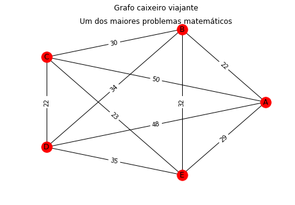
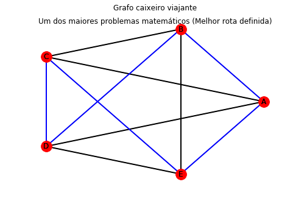

# ACOForTravellingSalesman

A way to solve the Traveler Salesman problem using the genetic algorithm and heuristic Ant Colony Optimization.

## Problem:



## Solution:



## Step by Step to Install:

First of all, have Python 3.6, pip and virtualenv installed.

1. Create a virtualenv for the project by prescribing Python 3.6:<br>
```virtualenv --python = python3.6 [environment name]```

2. Enter the virtualenv folder and activate it:<br>
```source bin/activate```

3. Make the clone or download the project into the part of the newly created virtualenv, 
create a folder called "ACOForTravellingSalesman" and put the repository files in it.

4. Enter the "app" folder and install pip dependencies:<br>
```pip install requirements.txt -r.```

5. Still in the app folder run ```jupyter notebook```